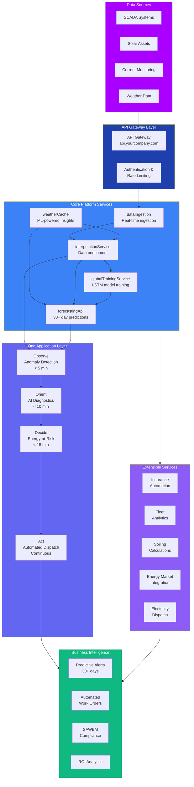
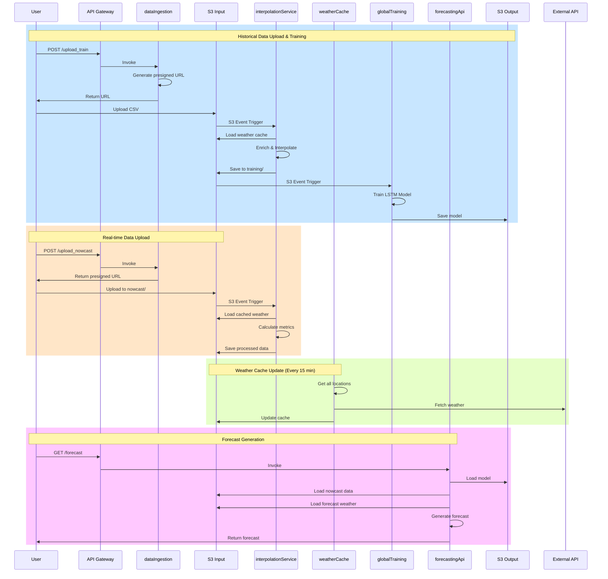

# Ona Platform: AI-Driven Solar Asset Management

The Ona Platform is a comprehensive, end-to-end solution for energy analytics and forecasting that transforms raw data from various sources into actionable insights, enabling predictive maintenance, optimized energy dispatch, and enhanced operational efficiency.

## 1. Overview

### What is Ona Platform?

The Ona Platform is an AI-driven solar asset management system built on a modern, scalable, and event-driven architecture. It provides real-time monitoring, predictive analytics, and automated maintenance workflows for solar energy portfolios.

### Key Value Propositions

- **Predictive Maintenance**: 30+ day forecasting capabilities for proactive maintenance planning
- **AI-Driven Optimization**: Transform reactive maintenance into AI-driven asset optimization
- **Real-Time Monitoring**: Sub-5 minute fault detection and diagnosis
- **Automated Workflows**: End-to-end automated workflows from fault prediction to work order execution
- **SAWEM Compliance**: Built specifically for South Africa's SAWEM requirements with insurance-grade reporting

### System Capabilities

- **Real-Time Data Processing**: Process SCADA/inverter data with sub-5 minute latency
- **Weather Integration**: ML-powered insights combining operational and meteorological data
- **Global Predictive Analytics**: 30+ day forecasting with natural language insights
- **Extensible Architecture**: Modular services that can be plugged into existing API ecosystem
- **Multi-Platform Integration**: Works with SolarEdge, Huawei FusionSolar, SMA Sunny Portal, and others

### Target Users and Use Cases

**Solar Asset Owners & Operators**
- Portfolio-wide performance monitoring
- Predictive maintenance scheduling
- Energy production optimization
- Compliance reporting

**EPC Companies**
- Seamless installation-to-O&M transition
- Revenue gap elimination
- Performance warranty management

**Asset Managers**
- Multi-site portfolio management
- Cross-site performance benchmarking
- Centralized reporting and analytics

## 2. Getting Started

### Prerequisites

Before deploying the Ona Platform, ensure you have:

1. **AWS Account**: With appropriate permissions for Lambda, API Gateway, S3, DynamoDB, and Route53
2. **Domain Access**: Control over a domain for API hosting (e.g., api.yourcompany.com)
3. **Data Sources**: Access to SCADA/inverter data streams
4. **Weather API Key**: Visual Crossing API key for weather data integration
5. **Docker**: Installed and running for containerized deployments

### Quick Deployment Guide

#### Option A: Automated Deployment (Recommended)

```bash
# 1. Clone the repository
git clone <repository-url>
cd ona-platform

# 2. Configure environment
cp config/environment.sh.example config/environment.sh
# Edit config/environment.sh with your settings

# 3. Set up DNS infrastructure (one-time)
cd dns-setup
./setup-dns-infrastructure.sh

# 4. Deploy the platform
cd ..
./deploy-all.sh

# 5. Validate deployment
./validate.sh
```

#### Option B: Manual Setup

```bash
# 1. Set up directories and parameters
./scripts/01-setup-directories.sh
./scripts/02-create-parameters.sh

# 2. Create IAM roles and storage
./scripts/03-create-iam.sh
./scripts/05-create-storage.sh

# 3. Build and deploy services
./scripts/07-build-and-push-docker.sh
./scripts/08-create-lambdas.sh

# 4. Configure API Gateway
./scripts/10-create-api-gateway.sh
./scripts/11-map-custom-domain.sh
```

### Configuration Requirements

#### Environment Variables
```bash
# AWS Configuration
export AWS_REGION="af-south-1"
export AWS_ACCOUNT_ID="your-account-id"
export ENVIRONMENT="prod"

# API Configuration
export API_DOMAIN="api.yourcompany.com"
export API_NAME="ona-api-prod"

# Service Configuration
export INPUT_BUCKET="your-input-bucket"
export OUTPUT_BUCKET="your-output-bucket"
```

#### Required Parameters
- Visual Crossing API key
- S3 bucket names for data storage
- DynamoDB table configurations
- Custom domain settings

### First-Time Setup

1. **Configure Visual Crossing API Key**:
   ```bash
   aws ssm put-parameter \
     --name /ona-platform/prod/visual-crossing-api-key \
     --value "YOUR_API_KEY" \
     --type SecureString \
     --overwrite
   ```

2. **Upload Initial Data**:
   ```bash
   # Upload historical data for model training
   curl -X POST https://api.yourcompany.com/upload_train
   
   # Upload real-time data
   curl -X POST https://api.yourcompany.com/upload_nowcast
   ```

3. **Test Forecast Generation**:
   ```bash
   # Generate your first forecast
   curl https://api.yourcompany.com/forecast?customer_id=test
   ```

## 3. System Architecture

### High-Level Architecture

The Ona Platform follows a layered architecture that transforms raw operational data into actionable business intelligence:



### Core Components Overview

**API Gateway Layer**
- Secure entry point with authentication and rate limiting
- Custom domain support (api.yourcompany.com)
- Request routing and load balancing

**Core Platform Services**
- **dataIngestion**: Real-time SCADA/inverter data ingestion and monitoring
- **weatherCache**: Weather data integration with ML-powered insights
- **interpolationService**: Data enrichment and ML interpolation
- **globalTrainingService**: LSTM model training and management
- **forecastingApi**: 30+ day forecasting capabilities

**Ona Application Layer (OODA Loop)**
- **Observe**: Anomaly detection in < 5 minutes
- **Orient**: AI diagnostics in < 10 minutes
- **Decide**: Energy-at-Risk calculation in < 15 minutes
- **Act**: Automated dispatch and continuous monitoring

**Extensible Services**
- Insurance automation
- Fleet analytics
- Soiling calculations
- Energy market integration
- Electricity dispatch optimization

### Data Flow and Service Interactions



### Technology Stack

**Infrastructure**
- **AWS Lambda**: Serverless compute for all services
- **API Gateway**: RESTful API management
- **S3**: Data storage and model artifacts
- **DynamoDB**: Metadata and configuration storage
- **EventBridge**: Event-driven scheduling
- **CloudWatch**: Monitoring and logging

**Data Processing**
- **Python**: Core service implementation
- **Docker**: Containerized deployments
- **LSTM Models**: Machine learning for forecasting
- **Pandas/NumPy**: Data processing and analysis

**External Integrations**
- **Visual Crossing**: Weather data API
- **SCADA Systems**: Real-time data ingestion
- **Solar Inverters**: Direct device integration

## 4. Core Services

### Data Ingestion Service

**Purpose**: Real-time SCADA/inverter data ingestion and monitoring

**Key Features**:
- Generates presigned URLs for secure data upload
- Handles both historical training data and real-time nowcast data
- Supports multiple data formats (CSV, JSON)
- Automatic data validation and error handling

**Endpoints**:
- `POST /upload_train` - Historical data upload for model training
- `POST /upload_nowcast` - Real-time data upload for forecasting

**Configuration**:
- Memory: 1024MB
- Timeout: 300 seconds
- Trigger: API Gateway

### Weather Cache Service

**Purpose**: Weather data integration with ML-powered insights

**Key Features**:
- Fetches current weather data every 15 minutes
- Caches weather data for efficient access
- Supports multiple weather data sources
- Automatic location-based weather retrieval

**Configuration**:
- Memory: 512MB
- Timeout: 300 seconds
- Trigger: EventBridge (rate: 15 minutes)

### Interpolation Service

**Purpose**: Data enrichment and ML interpolation

**Key Features**:
- Detects inverter brand and model automatically
- Enriches data with weather information
- Performs ML interpolation for missing data points
- Calculates performance metrics and KPIs

**Configuration**:
- Memory: 3008MB
- Timeout: 900 seconds
- Trigger: S3 events (historical/*, nowcast/*)

### Global Training Service

**Purpose**: LSTM model training and management

**Key Features**:
- Aggregates customer data for model training
- Trains LSTM models for energy forecasting
- Saves trained models to S3 for deployment
- Supports incremental model updates

**Configuration**:
- Memory: 1024MB
- Timeout: 300 seconds
- Trigger: S3 events (training/*)

### Forecasting API

**Purpose**: 30+ day forecasting capabilities

**Key Features**:
- Loads trained LSTM models from S3
- Reads nowcast data and weather forecasts
- Generates 48-hour energy production forecasts
- Provides confidence intervals and uncertainty bounds

**Configuration**:
- Memory: 3008MB
- Timeout: 60 seconds
- Trigger: API Gateway

**Endpoints**:
- `GET /forecast` - Generate energy production forecast

### OODA Application Layer (Operations & Maintenance)

**Purpose**: AI-driven asset management and maintenance optimization

**Key Components**:
- **Observe**: Real-time fault detection and anomaly identification
- **Orient**: AI-powered diagnostics and root cause analysis
- **Decide**: Energy-at-Risk calculations and maintenance scheduling
- **Act**: Automated work order creation and tracking

**Integration**: Works seamlessly with core services to provide end-to-end O&M workflows

## 5. Deployment Options

The Ona Platform offers flexible deployment options to integrate with your existing infrastructure:

### Option 1: Direct Data Feed (Most Common)

**Best for**: Organizations with existing SCADA/monitoring systems

**How it works**:
- Your inverters/SCADA systems continue sending data to your current dashboard
- We receive a copy of the same data stream via secure API or FTP
- Your team keeps using familiar tools while gaining Ona's predictive insights

**Benefits**:
- No disruption to existing operations
- Minimal integration effort
- Immediate access to AI insights
- Maintains current workflows

**Implementation**:
```bash
# Configure data feed endpoint
curl -X POST https://api.yourcompany.com/upload_nowcast \
  -H "Content-Type: application/json" \
  -d '{"data_source": "scada_system", "endpoint": "your-scada-endpoint"}'
```

### Option 2: Storage Integration

**Best for**: Organizations already using cloud storage

**How it works**:
- If you store data in cloud storage (AWS S3, Azure, Google Cloud)
- We connect directly to read your historical and real-time data
- No changes to your data collection process required

**Benefits**:
- Leverages existing cloud infrastructure
- No data duplication
- Automatic data synchronization
- Cost-effective storage utilization

**Implementation**:
```bash
# Grant access to existing S3 bucket
aws s3api put-bucket-policy --bucket your-existing-bucket \
  --policy '{
    "Version": "2012-10-17",
    "Statement": [{
      "Effect": "Allow",
      "Principal": {"AWS": "arn:aws:iam::ACCOUNT:role/ona-data-access"},
      "Action": ["s3:GetObject"],
      "Resource": "arn:aws:s3:::your-existing-bucket/*"
    }]
  }'
```

### Option 3: API Integration

**Best for**: Organizations with existing monitoring platforms

**How it works**:
- We pull data from your existing monitoring platform's API
- Works with SolarEdge, Huawei FusionSolar, SMA Sunny Portal, and others
- Completely non-invasive to your current operations

**Benefits**:
- No infrastructure changes required
- Works with existing monitoring tools
- Automatic data synchronization
- Platform-agnostic integration

**Supported Platforms**:
- **SolarEdge**: SolarEdge Monitoring API
- **Huawei**: FusionSolar API
- **SMA**: Sunny Portal API
- **Custom APIs**: RESTful API integration

**Implementation**:
```bash
# Configure platform integration
curl -X POST https://api.yourcompany.com/integrations \
  -H "Content-Type: application/json" \
  -d '{
    "platform": "solaredge",
    "api_key": "your-api-key",
    "site_id": "your-site-id"
  }'
```

### Integration with Existing Platforms

**SolarEdge Integration**:
```python
# Example SolarEdge data integration
import requests

def fetch_solaredge_data(site_id, api_key):
    url = f"https://monitoringapi.solaredge.com/site/{site_id}/overview"
    params = {"api_key": api_key}
    response = requests.get(url, params=params)
    return response.json()
```

**Huawei FusionSolar Integration**:
```python
# Example Huawei data integration
def fetch_huawei_data(station_code, token):
    url = f"https://intl.fusionsolar.huawei.com/thirdData/getStationRealKpi"
    headers = {"XSRF-TOKEN": token}
    data = {"stationCodes": station_code}
    response = requests.post(url, headers=headers, json=data)
    return response.json()
```

**SMA Sunny Portal Integration**:
```python
# Example SMA data integration
def fetch_sma_data(plant_id, api_key):
    url = f"https://api.sma-sunny.com/v2/plants/{plant_id}/data"
    headers = {"Authorization": f"Bearer {api_key}"}
    response = requests.get(url, headers=headers)
    return response.json()
```

### Migration Strategy

**Phase 1: Parallel Operation**
- Deploy Ona Platform alongside existing systems
- Run both systems in parallel for validation
- Compare results and fine-tune models

**Phase 2: Gradual Transition**
- Begin using Ona insights for decision making
- Gradually increase reliance on automated workflows
- Train staff on new processes and tools

**Phase 3: Full Integration**
- Complete transition to Ona Platform
- Decommission legacy systems
- Optimize operations based on AI insights

## 6. Troubleshooting

### Common Issues and Solutions

#### API Gateway Returns 403 Forbidden
**Symptoms**: `{"message":"Forbidden"}` when calling endpoints

**Solutions**:
```bash
# Check Lambda permissions
aws lambda get-policy --function-name ona-dataIngestion-prod

# Verify API deployment
aws apigateway get-deployments --rest-api-id <API_ID>

# Redeploy API if needed
aws apigateway create-deployment --rest-api-id <API_ID> --stage-name prod
```

#### Lambda Function Timeout
**Symptoms**: `Task timed out after 900.00 seconds`

**Solutions**:
```bash
# Check logs for specific errors
aws logs tail /aws/lambda/ona-interpolationService-prod --follow

# Verify weather API response time
curl -w "@curl-format.txt" -o /dev/null -s "https://weather.visualcrossing.com/VisualCrossingWebServices/rest/services/timeline/"

# Consider increasing timeout in configuration
```

#### S3 Trigger Not Firing
**Symptoms**: Files uploaded but Lambda not triggered

**Solutions**:
```bash
# Verify S3 notification configuration
aws s3api get-bucket-notification-configuration --bucket sa-api-client-input

# Re-run trigger configuration
./scripts/09-configure-triggers.sh

# Check Lambda permissions
aws lambda get-policy --function-name ona-interpolationService-prod
```

#### Custom Domain Not Working
**Symptoms**: api.yourcompany.com returns "could not resolve host"

**Solutions**:
```bash
# Check DNS resolution
nslookup api.yourcompany.com
dig api.yourcompany.com

# Verify domain mapping
aws apigateway get-domain-names --region af-south-1

# Wait for DNS propagation (5-15 minutes)
```

### Debugging Techniques

#### Enable Verbose Logging
```bash
# Set log level to DEBUG
aws ssm put-parameter \
  --name /ona-platform/prod/log-level \
  --value "DEBUG" \
  --type String \
  --overwrite
```

#### Monitor Real-Time Logs
```bash
# Follow logs for specific service
aws logs tail /aws/lambda/ona-weatherCache-prod --follow

# Monitor all platform logs
aws logs tail /aws/lambda/ona- --follow
```

#### Test Individual Components
```bash
# Test data ingestion
curl -X POST https://api.yourcompany.com/upload_train

# Test weather cache
aws lambda invoke --function-name ona-weatherCache-prod response.json

# Test forecasting
curl https://api.yourcompany.com/forecast?customer_id=test
```

### Performance Optimization

#### Optimize Lambda Performance
```bash
# Increase memory for compute-intensive services
aws lambda update-function-configuration \
  --function-name ona-interpolationService-prod \
  --memory-size 3008

# Optimize timeout settings
aws lambda update-function-configuration \
  --function-name ona-globalTrainingService-prod \
  --timeout 300
```

#### Monitor Resource Usage
```bash
# Check CloudWatch metrics
aws cloudwatch get-metric-statistics \
  --namespace AWS/Lambda \
  --metric-name Duration \
  --dimensions Name=FunctionName,Value=ona-forecastingApi-prod \
  --start-time 2025-01-15T00:00:00Z \
  --end-time 2025-01-15T23:59:59Z \
  --period 300 \
  --statistics Average,Maximum
```

### Support Resources

**Documentation**:
- [User Guide](user-guide.md) - Platform overview and value proposition
- [O&M Guide](O&M.md) - Operations and maintenance workflows
- [System Admin Guide](SYSTEM%20ADMIN.md) - Technical administration details
- [Pipeline Deployment](docs/PIPELINE%20DEPLOYMENT.md) - Deployment instructions

**Monitoring**:
- CloudWatch Dashboards: Real-time system metrics
- SNS Alerts: Automated notifications for critical issues
- Dead Letter Queues: Failed message analysis

**Community**:
- GitHub Issues: Bug reports and feature requests
- Documentation Wiki: Community-contributed guides
- Support Forums: User discussions and best practices

## 7. Contributing & Development

### Development Setup

#### Prerequisites
```bash
# Install required tools
pip install awscli docker-compose jq

# Configure AWS credentials
aws configure

# Clone repository
git clone <repository-url>
cd ona-platform
```

#### Local Development Environment
```bash
# Set up development environment
cp config/environment.sh.example config/environment.sh
# Edit config/environment.sh with development settings

# Build base Docker image
docker build -t ona-base services/base/

# Run services locally
docker-compose up -d
```

#### Testing Framework
```bash
# Run unit tests
python -m pytest tests/unit/

# Run integration tests
python -m pytest tests/integration/

# Run end-to-end tests
python -m pytest tests/e2e/
```

### Code Structure

```
ona-platform/
├── services/                 # Core service implementations
│   ├── base/                # Shared base image and utilities
│   ├── dataIngestion/       # Data ingestion service
│   ├── weatherCache/        # Weather caching service
│   ├── interpolationService/ # Data interpolation service
│   ├── globalTrainingService/ # Model training service
│   └── forecastingApi/      # Forecasting API service
├── scripts/                 # Deployment and configuration scripts
├── config/                 # Configuration files
├── docs/                   # Documentation
├── tests/                  # Test suites
└── dns-setup/             # DNS infrastructure setup
```

### Testing Guidelines

#### Unit Tests
- Test individual service functions
- Mock external dependencies
- Achieve >80% code coverage
- Include edge cases and error conditions

#### Integration Tests
- Test service interactions
- Validate data flow between components
- Test error handling and recovery
- Verify configuration management

#### End-to-End Tests
- Test complete user workflows
- Validate API endpoints
- Test deployment scenarios
- Verify monitoring and alerting

### Contribution Process

1. **Fork Repository**: Create your own fork of the repository
2. **Create Feature Branch**: `git checkout -b feature/your-feature-name`
3. **Write Tests**: Add tests for new functionality
4. **Implement Changes**: Write clean, documented code
5. **Run Tests**: Ensure all tests pass
6. **Submit Pull Request**: Include description of changes
7. **Code Review**: Address feedback from maintainers
8. **Merge**: Changes merged after approval

## 8. Resources & Support

### Documentation Links

**Core Documentation**:
- [User Guide](user-guide.md) - Platform overview and value proposition
- [O&M Guide](O&M.md) - Operations and maintenance workflows  
- [System Admin Guide](SYSTEM%20ADMIN.md) - Technical administration details
- [Pipeline Deployment](docs/PIPELINE%20DEPLOYMENT.md) - Deployment instructions

**Technical References**:
- [OODA Implementation](docs/ooda.md) - OODA loop command reference
- [OODA Logic](docs/ooda-logic.md) - Calculation specifications
- [OODA Reference](docs/ooda-reference.md) - Canonical technical specs
- [OODA Workflow](docs/ooda-workflow-implementation.md) - Implementation details

### Community Resources

**GitHub Repository**:
- Source code and issue tracking
- Feature requests and bug reports
- Community discussions and Q&A

**Documentation Wiki**:
- Community-contributed guides
- Best practices and use cases
- Troubleshooting tips and solutions

**Support Forums**:
- User discussions and knowledge sharing
- Platform updates and announcements
- Integration examples and tutorials

### Support Channels

**Technical Support**:
- Email: support@asoba.co
- Response time: 24-48 hours for technical issues
- Priority support available for enterprise customers

**Community Support**:
- GitHub Issues: Bug reports and feature requests
- Discussion Forums: User community support
- Documentation: Self-service resources

**Training Materials**:
- Video tutorials and webinars
- Hands-on workshops and training sessions
- Certification programs for platform administrators

### Getting Help

**Before Contacting Support**:
1. Check the documentation and troubleshooting guides
2. Search existing GitHub issues and discussions
3. Review CloudWatch logs for error details
4. Test with minimal configuration to isolate issues

**When Reporting Issues**:
- Include error messages and log excerpts
- Provide system configuration details
- Describe steps to reproduce the problem
- Include relevant environment information

**For Feature Requests**:
- Describe the business use case
- Explain the expected behavior
- Provide examples or mockups if applicable
- Consider impact on existing functionality

---

**Ready to get started?** Begin with the [Getting Started](#2-getting-started) section, or dive deeper into [System Architecture](#3-system-architecture) to understand how the platform works.

For detailed technical administration, see the [System Admin Guide](SYSTEM%20ADMIN.md).