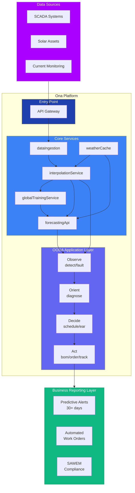
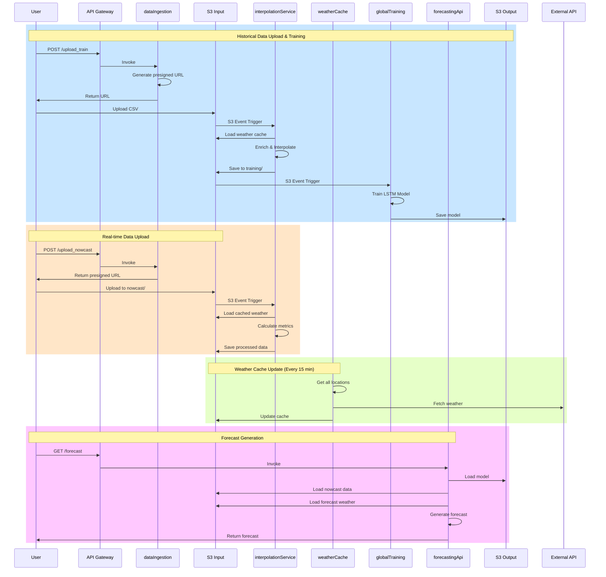
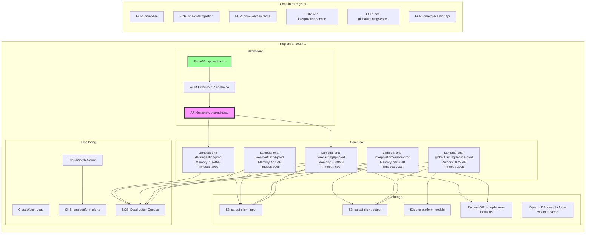

# Pipeline Deployment Scripting

## High Level Architecture




## **MVP Service Requirements**

| Service | Purpose | Status |
|---------|---------|---------|
| ✅ **ingestHistoricalLoadData** | `/upload_train` AND `/upload_nowcast` endpoints | EXISTS - needs to be extended with nowcast endpoint |
| ✅ **weatherCache** | Maintains fresh weather data | NEW |
| ✅ **interpolationService** | Processes both historical & nowcast | NEW |
| ✅ **globalTrainingService** | Trains models | NEW |
| ✅ **forecastingApi** | Generates forecasts | NEW |

**Note:** Based on our review, `ingestHistoricalLoadData` should be extended to handle both endpoints rather than creating a separate nowcast ingestion service.

## **MVP Script Structure and Content Mapping**

Here's the complete updated directory structure combining both the DNS setup stage and the full service structure:

### **Complete Directory Structure:**
```
ona-platform-mvp/
├── dns-setup/                    # Stage 1: DNS Infrastructure
│   ├── setup-dns-infrastructure.sh
│   └── verify-dns-ready.sh
├── deploy-all.sh                 # Stage 2: Main deployment script
├── config/
│   ├── environment.sh           # Environment variables
│   └── services.yaml            # Service configurations (from doc)
├── scripts/
│   ├── 01-setup-directories.sh  # Create service directories
│   ├── 02-create-parameters.sh  # SSM parameters (Visual Crossing key, etc)
│   ├── 03-create-iam.sh         # IAM roles/policies for all services
│   ├── 04-create-error-handling.sh  # DLQs and CloudWatch alarms
│   ├── 05-create-storage.sh     # S3 buckets (if not exist) + DynamoDB
│   ├── 06-create-ecr-repos.sh   # ECR repositories
│   ├── 07-build-and-push-docker.sh  # Build/push all Docker images
│   ├── 08-create-lambdas.sh     # Create Docker-based Lambda functions
│   ├── 09-configure-triggers.sh # S3 events + EventBridge schedules
│   ├── 10-create-api-gateway.sh # Create API with all endpoints
│   ├── 11-map-custom-domain.sh  # Map pre-configured domain to API
│   └── 12-validate-deployment.sh # Test all endpoints
├── services/                     # Service code (following doc structure)
│   ├── base/
│   │   ├── Dockerfile
│   │   ├── requirements-base.txt
│   │   └── utils/
│   │       └── common.py
│   ├── weatherCache/
│   │   ├── Dockerfile
│   │   ├── app.py
│   │   └── requirements.txt
│   ├── interpolationService/
│   │   ├── Dockerfile
│   │   ├── app.py
│   │   ├── requirements.txt
│   │   └── models/
│   │       └── .gitkeep
│   ├── globalTrainingService/
│   │   ├── Dockerfile
│   │   ├── app.py
│   │   └── requirements.txt
│   ├── forecastingApi/
│   │   ├── Dockerfile
│   │   ├── app.py
│   │   ├── requirements.txt
│   │   └── utils/
│   │       └── .gitkeep
│   └── dataIngestion/          # For upload endpoints
│       ├── Dockerfile
│       ├── app.py
│       └── requirements.txt
├── validate.sh                  # Standalone validation script
├── rollback.sh                  # Cleanup/rollback script
├── .certificate-arn             # Created by DNS setup (git-ignored)
├── .gitignore
└── README.md
```

### **.gitignore contents:**
```
# AWS credentials
.aws/

# Certificate tracking
.certificate-arn

# Python
__pycache__/
*.py[cod]
*$py.class
.env
venv/

# Docker
*.log

# OS
.DS_Store
Thumbs.db

# IDE
.vscode/
.idea/
*.swp
*.swo

# Temporary files
/tmp/
*.tmp
*.bak
```

### **README.md structure:**
```markdown
# ONA Platform MVP Deployment

## Prerequisites
- AWS CLI configured with appropriate credentials
- Docker installed
- AWS account with necessary permissions
- Domain asoba.co hosted in Route53

## Deployment Process

### Stage 1: DNS Infrastructure Setup (One-time)
```bash
cd dns-setup
./setup-dns-infrastructure.sh
```

This creates the SSL certificate for api.asoba.co and configures DNS validation.

### Stage 2: Main Deployment
```bash
./deploy-all.sh
```

This deploys all services and maps them to api.asoba.co.

## Validation
```bash
./validate.sh
```

## Rollback
```bash
./rollback.sh
```

## Service Endpoints
Once deployed, the following endpoints are available at https://api.asoba.co:
- POST /upload_train
- POST /upload_nowcast
- GET /forecast

## **Architecture**

```mermaid
graph TB
    subgraph "Data Sources"
        HC[Historical CSV Upload]
        RT[Real-time Inverter Data]
        FC[Forecast Consumer]
    end

    subgraph "API Gateway - api.asoba.co"
        API[API Gateway<br/>api.asoba.co]
        UP1[POST /upload_train]
        UP2[POST /upload_nowcast]
        FE[GET /forecast]
    end

    subgraph "Lambda Functions"
        DI[dataIngestion Lambda<br/>• Generates presigned URLs<br/>• Handles both upload endpoints]
        WC[weatherCache Lambda<br/>• Runs every 15 minutes<br/>• Fetches current weather<br/>• Updates cache]
        IS[interpolationService Lambda<br/>• Detects inverter brand<br/>• Enriches with weather<br/>• ML interpolation<br/>• Performance metrics]
        GT[globalTrainingService Lambda<br/>• Aggregates customer data<br/>• Trains LSTM model<br/>• Saves to S3]
        FA[forecastingApi Lambda<br/>• Loads trained model<br/>• Reads nowcast data<br/>• Generates 48h forecast]
    end

    subgraph "Storage"
        S3I[S3: sa-api-client-input<br/>• /historical/<br/>• /nowcast/<br/>• /training/<br/>• /weather/cache/]
        S3O[S3: sa-api-client-output<br/>• /models/]
        DDB[DynamoDB<br/>ona-platform-locations]
    end

    subgraph "External"
        VC[Visual Crossing<br/>Weather API]
    end

    %% Data flow
    HC -->|Upload| UP1
    RT -->|Upload| UP2
    FC -->|Request| FE
    
    UP1 --> DI
    UP2 --> DI
    FE --> FA
    
    DI -->|Presigned URL| S3I
    
    S3I -->|S3 Event: historical/*| IS
    S3I -->|S3 Event: nowcast/*| IS
    
    WC -->|Fetch Weather| VC
    WC -->|Store| S3I
    WC -->|Read Locations| DDB
    
    IS -->|Load Weather| S3I
    IS -->|Save Processed| S3I
    
    S3I -->|S3 Event: training/*| GT
    GT -->|Save Model| S3O
    
    FA -->|Load Model| S3O
    FA -->|Load Nowcast| S3I
    FA -->|Load Weather| S3I

    %% Scheduling
    Schedule[EventBridge<br/>rate: 15 minutes] -->|Trigger| WC

    style API fill:#f9f,stroke:#333,stroke-width:4px
    style S3I fill:#000,stroke:#333,stroke-width:2px
    style S3O fill:#000,stroke:#333,stroke-width:2px
    style DDB fill:#000,stroke:#333,stroke-width:2px
    style VC fill:#f99,stroke:#333,stroke-width:2px
```



### **Data Flow Sequence**



### **Infrastructure Components**



## **Troubleshooting**

### **Common Issues and Solutions**

#### **1. Certificate Validation Fails**
```bash
# Symptom
Error: Certificate validation timed out

# Check certificate status
aws acm describe-certificate --certificate-arn <ARN> --region us-east-1

# Solution
1. Verify CNAME records were added correctly:
   aws route53 list-resource-record-sets --hosted-zone-id Z02057713AMAS6GXTEGNR

2. If records are missing, manually add them
3. Wait 5-30 minutes for DNS propagation
```

#### **2. Docker Build Fails**
```bash
# Symptom
Error: Cannot connect to Docker daemon

# Solution
sudo systemctl start docker  # Linux
open -a Docker  # macOS

# If ECR login fails
aws ecr get-login-password --region af-south-1 | docker login --username AWS --password-stdin $ECR_REGISTRY
```

#### **3. Lambda Function Timeout**
```bash
# Symptom
Task timed out after 900.00 seconds

# Check logs
aws logs tail /aws/lambda/ona-interpolationService-prod --follow

# Solution
1. Check if weather API is responding slowly
2. Verify S3 file sizes aren't too large
3. Consider increasing timeout in config/environment.sh
```

#### **4. S3 Trigger Not Firing**
```bash
# Symptom
Files uploaded but Lambda not triggered

# Verify S3 notification configuration
aws s3api get-bucket-notification-configuration --bucket sa-api-client-input

# Solution
1. Re-run scripts/09-configure-triggers.sh
2. Check Lambda has permission:
   aws lambda get-policy --function-name ona-interpolationService-prod

3. Ensure file is in correct prefix (historical/ or nowcast/)
```

#### **5. API Gateway Returns 403 Forbidden**
```bash
# Symptom
{"message":"Forbidden"}

# Solution
1. Check Lambda permissions:
   aws lambda get-policy --function-name ona-dataIngestion-prod | jq '.Policy' | jq '.Statement[]'

2. Verify API deployment:
   aws apigateway get-deployments --rest-api-id <API_ID>

3. Redeploy API:
   aws apigateway create-deployment --rest-api-id <API_ID> --stage-name prod
```

#### **6. Visual Crossing API Key Not Working**
```bash
# Symptom
Error: 401 Unauthorized from Visual Crossing

# Verify parameter value
aws ssm get-parameter --name /ona-platform/prod/visual-crossing-api-key --with-decryption

# Solution
aws ssm put-parameter \
  --name /ona-platform/prod/visual-crossing-api-key \
  --value "YOUR_ACTUAL_API_KEY" \
  --type SecureString \
  --overwrite
```

#### **7. Custom Domain Not Working**
```bash
# Symptom
api.asoba.co returns "could not resolve host"

# Check DNS
nslookup api.asoba.co
dig api.asoba.co

# Verify domain mapping
aws apigateway get-domain-names --region af-south-1

# Solution
1. Check Route53 A record exists
2. Wait 5-15 minutes for DNS propagation
3. Use fallback URL while waiting:
   https://{api-id}.execute-api.af-south-1.amazonaws.com/prod
```

#### **8. DynamoDB Table Not Found**
```bash
# Symptom
ResourceNotFoundException: Requested resource not found

# List tables
aws dynamodb list-tables --region af-south-1

# Solution
Run scripts/05-create-storage.sh again
```

#### **9. CloudWatch Logs Not Appearing**
```bash
# Symptom
No logs in CloudWatch

# Check log group exists
aws logs describe-log-groups --log-group-name-prefix /aws/lambda/ona-

# Solution
1. Verify IAM role has logs:CreateLogGroup permission
2. Check Lambda environment variable LOG_LEVEL is set
3. Manually create log group:
   aws logs create-log-group --log-group-name /aws/lambda/ona-weatherCache-prod
```

#### **10. Rollback Script Fails**
```bash
# Symptom
Error deleting resources

# Solution
1. Some resources may already be deleted - this is OK
2. For stubborn resources, delete manually:
   - Check CloudFormation stacks
   - Check for resource dependencies
3. S3 buckets with data must be emptied first:
   aws s3 rm s3://bucket-name --recursive
```

### **Key Feaures:**

1. **Follows exact naming**: `ona-{serviceName}-{stage}` not `ona-mvp-{service}`
2. **Custom domain setup**: Implements api.asoba.co configuration
3. **All 5 MVP services** properly named:
   - ona-dataIngestion-prod (handles both upload endpoints)
   - ona-weatherCache-prod
   - ona-interpolationService-prod
   - ona-globalTrainingService-prod
   - ona-forecastingApi-prod
4. **Proper Docker structure**: Base image + service-specific images as shown in doc
5. **Error handling infrastructure**: DLQs and alarms as specified
6. **Uses existing buckets**: sa-api-client-input/output (with proper checks)

### **Script Execution Order:**

#### Stage 1: DNS Infrastructure Setup (Run Once, Days/Weeks Before)
setup-dns-infrastructure.sh
- Request SSL certificate for api.asoba.co
- Add CNAME validation records
- Wait for certificate validation
- Verify certificate is ISSUED
- Maybe even create the custom domain name in API Gateway (empty)
✅ DNS infrastructure ready and waiting

#### Stage 2: Main Deployment (Run Anytime After)
deploy-all.sh
- Build everything else
- At step 11, just map the existing custom domain to the API
- No waiting, no DNS propagation delays
✅ Instant api.asoba.co availability

### **Final Endpoints (as specified):**
- POST https://api.asoba.co/upload_train
- POST https://api.asoba.co/upload_nowcast
- GET https://api.asoba.co/forecast


I'll provide the properly updated scripts based on our two-stage approach. Let me create them systematically:

## **Stage 1: DNS Infrastructure Setup**

### **dns-setup/setup-dns-infrastructure.sh**
```bash
#!/bin/bash
# setup-dns-infrastructure.sh - One-time DNS and certificate setup for api.asoba.co

set -euo pipefail

# Configuration
export AWS_REGION="af-south-1"
export AWS_ACCOUNT_ID=$(aws sts get-caller-identity --query Account --output text)
export API_DOMAIN="api.asoba.co"
export HOSTED_ZONE_ID="Z02057713AMAS6GXTEGNR"

# Color codes
RED='\033[0;31m'
GREEN='\033[0;32m'
YELLOW='\033[1;33m'
NC='\033[0m'

echo "=========================================="
echo "ONA Platform DNS Infrastructure Setup"
echo "=========================================="
echo "Domain: ${API_DOMAIN}"
echo "Hosted Zone: ${HOSTED_ZONE_ID}"
echo "Account: ${AWS_ACCOUNT_ID}"
echo ""

# Function to log with timestamp
log() {
    echo "[$(date +'%Y-%m-%d %H:%M:%S')] $1"
}

# Check prerequisites
log "Checking prerequisites..."

if ! command -v aws &> /dev/null; then
    echo -e "${RED}ERROR: AWS CLI not found${NC}"
    exit 1
fi

if ! command -v jq &> /dev/null; then
    echo -e "${RED}ERROR: jq not found. Please install jq.${NC}"
    exit 1
fi

# Verify hosted zone exists
log "Verifying Route53 hosted zone..."
if ! aws route53 get-hosted-zone --id "${HOSTED_ZONE_ID}" &>/dev/null; then
    echo -e "${RED}ERROR: Hosted zone ${HOSTED_ZONE_ID} not found${NC}"
    exit 1
fi

# Check if certificate already exists and is valid
log "Checking for existing certificate..."
EXISTING_CERT=$(aws acm list-certificates \
    --query "CertificateSummaryList[?DomainName=='${API_DOMAIN}' && Status=='ISSUED'].CertificateArn" \
    --output text \
    --region us-east-1)

if [ -n "$EXISTING_CERT" ]; then
    echo -e "${GREEN}✓ Certificate already exists and is validated${NC}"
    echo "Certificate ARN: ${EXISTING_CERT}"
    echo "${EXISTING_CERT}" > .certificate-arn
    echo ""
    echo -e "${GREEN}DNS infrastructure is ready. You can run the main deployment.${NC}"
    exit 0
fi

# Check for pending certificates
PENDING_CERT=$(aws acm list-certificates \
    --query "CertificateSummaryList[?DomainName=='${API_DOMAIN}' && Status=='PENDING_VALIDATION'].CertificateArn" \
    --output text \
    --region us-east-1)

if [ -n "$PENDING_CERT" ]; then
    echo -e "${YELLOW}Found pending certificate: ${PENDING_CERT}${NC}"
    echo "Checking validation status..."
    CERT_ARN="${PENDING_CERT}"
else
    # Request new certificate
    log "Requesting SSL certificate for ${API_DOMAIN}..."
    CERT_ARN=$(aws acm request-certificate \
        --domain-name "${API_DOMAIN}" \
        --validation-method DNS \
        --subject-alternative-names "${API_DOMAIN}" \
        --tags Key=Project,Value=ona-platform Key=Environment,Value=prod Key=Service,Value=api-gateway \
        --region us-east-1 \
        --query 'CertificateArn' \
        --output text)
    
    if [ -z "$CERT_ARN" ]; then
        echo -e "${RED}ERROR: Failed to request certificate${NC}"
        exit 1
    fi
    
    echo "Certificate requested: ${CERT_ARN}"
    
    # Wait for certificate to be ready for validation
    log "Waiting for certificate to be ready..."
    sleep 10
fi

# Save certificate ARN
echo "${CERT_ARN}" > .certificate-arn

# Get validation records
log "Getting DNS validation records..."
MAX_ATTEMPTS=6
ATTEMPT=0

while [ $ATTEMPT -lt $MAX_ATTEMPTS ]; do
    VALIDATION_RECORD=$(aws acm describe-certificate \
        --certificate-arn "${CERT_ARN}" \
        --region us-east-1 \
        --query 'Certificate.DomainValidationOptions[0].ResourceRecord' \
        --output json 2>/dev/null || echo "{}")
    
    RECORD_NAME=$(echo "$VALIDATION_RECORD" | jq -r '.Name // empty')
    RECORD_VALUE=$(echo "$VALIDATION_RECORD" | jq -r '.Value // empty')
    
    if [ -n "$RECORD_NAME" ] && [ "$RECORD_NAME" != "null" ]; then
        break
    fi
    
    ((ATTEMPT++))
    log "Waiting for validation records... (${ATTEMPT}/${MAX_ATTEMPTS})"
    sleep 5
done

if [ -z "$RECORD_NAME" ] || [ "$RECORD_NAME" == "null" ]; then
    echo -e "${RED}ERROR: Could not get validation records${NC}"
    echo "Please check the certificate status manually:"
    echo "aws acm describe-certificate --certificate-arn ${CERT_ARN} --region us-east-1"
    exit 1
fi

echo "Validation record needed:"
echo "  Name: ${RECORD_NAME}"
echo "  Value: ${RECORD_VALUE}"

# Check if validation record already exists
log "Checking if validation record already exists..."
EXISTING_RECORD=$(aws route53 list-resource-record-sets \
    --hosted-zone-id "${HOSTED_ZONE_ID}" \
    --query "ResourceRecordSets[?Name=='${RECORD_NAME}' && Type=='CNAME'].ResourceRecords[0].Value" \
    --output text 2>/dev/null || echo "")

if [ "$EXISTING_RECORD" == "$RECORD_VALUE" ]; then
    echo -e "${GREEN}✓ Validation record already exists${NC}"
else
    # Create validation record in Route53
    log "Adding validation record to Route53..."
    
    cat > /tmp/validation-record.json << EOF
{
    "Changes": [{
        "Action": "UPSERT",
        "ResourceRecordSet": {
            "Name": "${RECORD_NAME}",
            "Type": "CNAME",
            "TTL": 300,
            "ResourceRecords": [{
                "Value": "${RECORD_VALUE}"
            }]
        }
    }]
}
EOF

    CHANGE_ID=$(aws route53 change-resource-record-sets \
        --hosted-zone-id "${HOSTED_ZONE_ID}" \
        --change-batch file:///tmp/validation-record.json \
        --query 'ChangeInfo.Id' \
        --output text)
    
    echo "DNS record created. Change ID: ${CHANGE_ID}"
    
    # Wait for DNS propagation
    log "Waiting for DNS record to propagate..."
    aws route53 wait resource-record-sets-changed --id "${CHANGE_ID}"
    echo -e "${GREEN}✓ DNS record propagated${NC}"
    
    # Clean up
    rm -f /tmp/validation-record.json
fi

# Wait for certificate validation
echo ""
echo "Waiting for certificate validation..."
echo "This typically takes 2-10 minutes but can take up to 30 minutes."
echo ""

# Poll for validation with visual progress
ATTEMPTS=0
MAX_ATTEMPTS=60  # 30 minutes max
SPINNER=('⠋' '⠙' '⠹' '⠸' '⠼' '⠴' '⠦' '⠧' '⠇' '⠏')

while [ $ATTEMPTS -lt $MAX_ATTEMPTS ]; do
    STATUS=$(aws acm describe-certificate \
        --certificate-arn "${CERT_ARN}" \
        --region us-east-1 \
        --query 'Certificate.Status' \
        --output text)
    
    if [ "$STATUS" == "ISSUED" ]; then
        echo -e "\n${GREEN}✓ Certificate validated successfully!${NC}"
        break
    else
        # Show spinner
        printf "\r${SPINNER[$((ATTEMPTS % 10))]} Certificate status: ${STATUS} (${ATTEMPTS}/2 minutes elapsed)"
        sleep 30
        ((ATTEMPTS++))
    fi
done

echo ""

if [ "$STATUS" != "ISSUED" ]; then
    echo -e "${YELLOW}⚠️  Certificate validation is taking longer than expected.${NC}"
    echo "Current status: ${STATUS}"
    echo ""
    echo "This can happen due to DNS propagation delays."
    echo "The certificate will continue validating in the background."
    echo ""
    echo "To check status later:"
    echo "  aws acm describe-certificate --certificate-arn ${CERT_ARN} --region us-east-1 --query 'Certificate.Status'"
    echo ""
    echo "Once status shows 'ISSUED', you can run the main deployment."
else
    echo ""
    echo "=========================================="
    echo -e "${GREEN}✓ DNS Infrastructure Setup Complete!${NC}"
    echo "=========================================="
    echo ""
    echo "Certificate ARN: ${CERT_ARN}"
    echo ""
    echo "You can now run: ./deploy-all.sh"
fi

# Create verification script for convenience
cat > dns-setup/check-certificate-status.sh << 'EOF'
#!/bin/bash
# check-certificate-status.sh - Check certificate validation status

if [ -f .certificate-arn ]; then
    CERT_ARN=$(cat .certificate-arn)
    STATUS=$(aws acm describe-certificate \
        --certificate-arn "${CERT_ARN}" \
        --region us-east-1 \
        --query 'Certificate.Status' \
        --output text)
    
    echo "Certificate: ${CERT_ARN}"
    echo "Status: ${STATUS}"
    
    if [ "$STATUS" == "ISSUED" ]; then
        echo "✓ Certificate is ready!"
    else
        echo "⏳ Certificate is still validating..."
    fi
else
    echo "No certificate ARN found. Run setup-dns-infrastructure.sh first."
fi
EOF

chmod +x dns-setup/check-certificate-status.sh
```

### **dns-setup/verify-dns-ready.sh**
```bash
#!/bin/bash
# verify-dns-ready.sh - Verify DNS infrastructure is ready before main deployment

set -euo pipefail

# Color codes
RED='\033[0;31m'
GREEN='\033[0;32m'
YELLOW='\033[1;33m'
NC='\033[0m'

export API_DOMAIN="api.asoba.co"

echo "Verifying DNS infrastructure..."

# Check for certificate ARN file
if [ ! -f .certificate-arn ]; then
    echo -e "${RED}❌ Certificate ARN file not found${NC}"
    echo ""
    echo "Please run ./dns-setup/setup-dns-infrastructure.sh first"
    exit 1
fi

CERT_ARN=$(cat .certificate-arn)

# Verify certificate exists and is valid
STATUS=$(aws acm describe-certificate \
    --certificate-arn "${CERT_ARN}" \
    --region us-east-1 \
    --query 'Certificate.Status' \
    --output text 2>/dev/null || echo "NOT_FOUND")

if [ "$STATUS" == "NOT_FOUND" ]; then
    echo -e "${RED}❌ Certificate not found: ${CERT_ARN}${NC}"
    exit 1
fi

if [ "$STATUS" != "ISSUED" ]; then
    echo -e "${YELLOW}⚠️  Certificate status is ${STATUS}, not ISSUED${NC}"
    echo ""
    echo "The certificate is still being validated."
    echo "You can proceed with deployment, but custom domain setup will be skipped."
    echo ""
    read -p "Continue anyway? (y/n) " -n 1 -r
    echo ""
    if [[ ! $REPLY =~ ^[Yy]$ ]]; then
        exit 1
    fi
    export SKIP_CUSTOM_DOMAIN=true
else
    echo -e "${GREEN}✓ Certificate found and validated${NC}"
    echo "  ARN: ${CERT_ARN}"
    echo "  Status: ${STATUS}"
    export SKIP_CUSTOM_DOMAIN=false
fi

# Export for use in deployment
export CERTIFICATE_ARN="${CERT_ARN}"

echo -e "${GREEN}✓ DNS infrastructure check complete${NC}"
```

## **Stage 2: Main Deployment Scripts**

### **Updated deploy-all.sh**
```bash
#!/bin/bash
# deploy-all.sh - Main deployment script (DNS infrastructure should be ready)

set -euo pipefail

# Color codes
RED='\033[0;31m'
GREEN='\033[0;32m'
YELLOW='\033[1;33m'
BLUE='\033[0;34m'
NC='\033[0m'

# Load configuration
source config/environment.sh

echo -e "${BLUE}=========================================="
echo "ONA Platform Deployment"
echo "==========================================${NC}"
echo "Account: ${AWS_ACCOUNT_ID}"
echo "Region: ${AWS_REGION}"
echo "Environment: ${ENVIRONMENT}"
echo ""

# Pre-flight checks
log "Running pre-flight checks..."

# Check DNS infrastructure
echo -n "Checking DNS infrastructure... "
if source ./dns-setup/verify-dns-ready.sh &>/dev/null; then
    echo -e "${GREEN}✓${NC}"
    if [ "${SKIP_CUSTOM_DOMAIN:-false}" == "true" ]; then
        echo -e "${YELLOW}  Note: Custom domain will be skipped (certificate not ready)${NC}"
    fi
else
    echo -e "${RED}✗${NC}"
    echo ""
    echo -e "${RED}DNS infrastructure not ready${NC}"
    echo "Please run: ./dns-setup/setup-dns-infrastructure.sh"
    echo ""
    exit 1
fi

# Check AWS CLI
echo -n "Checking AWS CLI... "
if command -v aws &> /dev/null; then
    echo -e "${GREEN}✓${NC}"
else
    echo -e "${RED}✗${NC}"
    echo "Please install AWS CLI"
    exit 1
fi

# Check Docker
echo -n "Checking Docker... "
if command -v docker &> /dev/null && docker info &>/dev/null; then
    echo -e "${GREEN}✓${NC}"
else
    echo -e "${RED}✗${NC}"
    echo "Please install Docker and ensure it's running"
    exit 1
fi

# Check AWS credentials
echo -n "Checking AWS credentials... "
if aws sts get-caller-identity &> /dev/null; then
    echo -e "${GREEN}✓${NC}"
else
    echo -e "${RED}✗${NC}"
    echo "Please configure AWS credentials"
    exit 1
fi

# Check jq
echo -n "Checking jq... "
if command -v jq &> /dev/null; then
    echo -e "${GREEN}✓${NC}"
else
    echo -e "${RED}✗${NC}"
    echo "Please install jq"
    exit 1
fi

echo ""
log "All pre-flight checks passed ✓"
echo ""

# Track deployment progress
TOTAL_STEPS=12
CURRENT_STEP=0

# Function to show progress
show_progress() {
    CURRENT_STEP=$((CURRENT_STEP + 1))
    local PERCENT=$((CURRENT_STEP * 100 / TOTAL_STEPS))
    echo -e "${BLUE}[${CURRENT_STEP}/${TOTAL_STEPS}] ${1}${NC} ($PERCENT%)"
}

# Execute deployment scripts in order
SCRIPTS=(
    "01-setup-directories.sh:Setting up directories"
    "02-create-parameters.sh:Creating parameters"
    "03-create-iam.sh:Creating IAM roles"
    "04-create-error-handling.sh:Setting up error handling"
    "05-create-storage.sh:Creating storage resources"
    "06-create-ecr-repos.sh:Creating ECR repositories"
    "07-build-and-push-docker.sh:Building Docker images"
    "08-create-lambdas.sh:Creating Lambda functions"
    "09-configure-triggers.sh:Configuring triggers"
    "10-create-api-gateway.sh:Creating API Gateway"
    "11-map-custom-domain.sh:Mapping custom domain"
    "12-validate-deployment.sh:Validating deployment"
)

# Start deployment
echo -e "${BLUE}Starting deployment...${NC}"
echo ""

DEPLOYMENT_START=$(date +%s)

for script_info in "${SCRIPTS[@]}"; do
    IFS=':' read -r script description <<< "$script_info"
    
    echo "=========================================="
    show_progress "$description"
    echo "=========================================="
    
    # Skip custom domain if certificate not ready
    if [[ "$script" == "11-map-custom-domain.sh" ]] && [[ "${SKIP_CUSTOM_DOMAIN:-false}" == "true" ]]; then
        echo -e "${YELLOW}Skipping custom domain mapping (certificate not ready)${NC}"
        echo ""
        continue
    fi
    
    START_TIME=$(date +%s)
    
    if bash "scripts/$script"; then
        END_TIME=$(date +%s)
        DURATION=$((END_TIME - START_TIME))
        echo -e "${GREEN}✓ Completed in ${DURATION}s${NC}"
    else
        echo -e "${RED}✗ Failed${NC}"
        echo "Deployment stopped at: $script"
        exit 1
    fi
    echo ""
done

DEPLOYMENT_END=$(date +%s)
TOTAL_DURATION=$((DEPLOYMENT_END - DEPLOYMENT_START))

# Get API endpoints
API_ID=$(aws apigateway get-rest-apis --query "items[?name=='${API_NAME}'].id" --output text --region $AWS_REGION)
API_BASE_URL="https://${API_ID}.execute-api.${AWS_REGION}.amazonaws.com/${STAGE}"

# Output summary
echo -e "${GREEN}=========================================="
echo "✓ Deployment completed successfully!"
echo "==========================================${NC}"
echo ""
echo "Deployment time: ${TOTAL_DURATION} seconds"
echo ""
echo -e "${BLUE}API Endpoints:${NC}"

if [[ "${SKIP_CUSTOM_DOMAIN:-false}" != "true" ]]; then
    echo -e "${GREEN}Production URLs:${NC}"
    echo "  POST https://api.asoba.co/upload_train"
    echo "  POST https://api.asoba.co/upload_nowcast"
    echo "  GET  https://api.asoba.co/forecast"
    echo ""
fi

echo -e "${YELLOW}Direct API Gateway URLs:${NC}"
echo "  POST ${API_BASE_URL}/upload_train"
echo "  POST ${API_BASE_URL}/upload_nowcast"
echo "  GET  ${API_BASE_URL}/forecast"
echo ""

echo -e "${BLUE}Next steps:${NC}"
echo "1. Update Visual Crossing API key:"
echo "   aws ssm put-parameter --name /ona-platform/prod/visual-crossing-api-key --value YOUR_KEY --type SecureString --overwrite"
echo ""
echo "2. Test the endpoints:"
echo "   curl -X POST ${API_BASE_URL}/upload_train"
echo ""
echo "3. Monitor logs:"
echo "   aws logs tail /aws/lambda/ona-weatherCache-prod --follow"
echo ""

# Save deployment info
cat > .deployment-info << EOF
DEPLOYMENT_DATE=$(date -u +"%Y-%m-%d %H:%M:%S UTC")
API_ID=${API_ID}
API_BASE_URL=${API_BASE_URL}
CUSTOM_DOMAIN_ENABLED=${SKIP_CUSTOM_DOMAIN:-false}
REGION=${AWS_REGION}
ENVIRONMENT=${ENVIRONMENT}
EOF

echo "Deployment information saved to .deployment-info"
```

### **Updated scripts/11-map-custom-domain.sh**
```bash
#!/bin/bash
# 11-map-custom-domain.sh - Map pre-validated certificate to API Gateway

source config/environment.sh

log "Configuring custom domain mapping..."

# Check if we should skip
if [ "${SKIP_CUSTOM_DOMAIN:-false}" == "true" ]; then
    log "Skipping custom domain setup (certificate not ready)"
    exit 0
fi

# Load certificate ARN
if [ ! -f .certificate-arn ]; then
    log "WARNING: Certificate ARN file not found"
    log "Custom domain will not be configured"
    exit 0
fi

CERTIFICATE_ARN=$(cat .certificate-arn)

# Get API ID
API_ID=$(aws apigateway get-rest-apis \
    --query "items[?name=='${API_NAME}'].id" \
    --output text \
    --region $AWS_REGION)

if [ -z "$API_ID" ]; then
    log "ERROR: API Gateway not found"
    exit 1
fi

log "Using API ID: ${API_ID}"

# Check if custom domain already exists
DOMAIN_EXISTS=$(aws apigateway get-domain-name \
    --domain-name "$API_DOMAIN" \
    --region $AWS_REGION 2>&1 || echo "NOT_FOUND")

if [[ "$DOMAIN_EXISTS" != *"NOT_FOUND"* ]]; then
    log "Custom domain ${API_DOMAIN} already exists"
    DOMAIN_INFO=$(aws apigateway get-domain-name \
        --domain-name "$API_DOMAIN" \
        --region $AWS_REGION)
else
    log "Creating custom domain ${API_DOMAIN}..."
    
    # Create custom domain
    DOMAIN_INFO=$(aws apigateway create-domain-name \
        --domain-name "$API_DOMAIN" \
        --regional-certificate-arn "$CERTIFICATE_ARN" \
        --endpoint-configuration types=REGIONAL \
        --tags $STANDARD_TAGS \
        --region $AWS_REGION)
    
    if [ $? -ne 0 ]; then
        log "ERROR: Failed to create custom domain"
        exit 1
    fi
fi

# Extract domain information
TARGET_DOMAIN=$(echo "$DOMAIN_INFO" | jq -r '.regionalDomainName')
HOSTED_ZONE_ID_ALIAS=$(echo "$DOMAIN_INFO" | jq -r '.regionalHostedZoneId')

log "Target domain: ${TARGET_DOMAIN}"
log "Alias hosted zone: ${HOSTED_ZONE_ID_ALIAS}"

# Check if base path mapping exists
MAPPING_EXISTS=$(aws apigateway get-base-path-mappings \
    --domain-name "$API_DOMAIN" \
    --region $AWS_REGION 2>&1 || echo "NONE")

if [[ "$MAPPING_EXISTS" == *"$API_ID"* ]]; then
    log "Base path mapping already exists"
else
    log "Creating base path mapping..."
    
    # Remove any existing mappings first
    if [[ "$MAPPING_EXISTS" != *"NONE"* ]]; then
        EXISTING_MAPPINGS=$(aws apigateway get-base-path-mappings \
            --domain-name "$API_DOMAIN" \
            --region $AWS_REGION \
            --query 'items[].basePath' \
            --output text)
        
        for path in $EXISTING_MAPPINGS; do
            if [ "$path" == "(none)" ]; then
                path=""
            fi
            log "Removing existing mapping: ${path:-'(root)'}"
            aws apigateway delete-base-path-mapping \
                --domain-name "$API_DOMAIN" \
                --base-path "$path" \
                --region $AWS_REGION 2>/dev/null || true
        done
    fi
    
    # Create new base path mapping
    aws apigateway create-base-path-mapping \
        --domain-name "$API_DOMAIN" \
        --rest-api-id "$API_ID" \
        --stage "$STAGE" \
        --region $AWS_REGION
    
    if [ $? -ne 0 ]; then
        log "ERROR: Failed to create base path mapping"
        exit 1
    fi
fi

# Update Route53 A record
log "Updating Route53 A record..."

cat > /tmp/api-a-record.json << EOF
{
    "Changes": [{
        "Action": "UPSERT",
        "ResourceRecordSet": {
            "Name": "${API_DOMAIN}",
            "Type": "A",
            "AliasTarget": {
                "DNSName": "${TARGET_DOMAIN}",
                "EvaluateTargetHealth": false,
                "HostedZoneId": "${HOSTED_ZONE_ID_ALIAS}"
            }
        }
    }]
}
EOF

CHANGE_ID=$(aws route53 change-resource-record-sets \
    --hosted-zone-id "$HOSTED_ZONE_ID" \
    --change-batch file:///tmp/api-a-record.json \
    --query 'ChangeInfo.Id' \
    --output text)

if [ $? -eq 0 ]; then
    log "DNS A record updated. Change ID: ${CHANGE_ID}"
    
    # Wait for DNS propagation
    log "Waiting for DNS propagation..."
    aws route53 wait resource-record-sets-changed --id "${CHANGE_ID}"
    log "DNS propagation complete"
else
    log "WARNING: Failed to update DNS record"
fi

# Clean up
rm -f /tmp/api-a-record.json

log "Custom domain mapping completed ✓"
echo ""
echo "Note: DNS propagation to all nameservers may take 5-15 minutes"
echo "Test with: curl https://api.asoba.co/health"
```

### **Updated scripts/12-validate-deployment.sh**
```bash
#!/bin/bash
# 12-validate-deployment.sh - Comprehensive deployment validation

source config/environment.sh

# Color codes
RED='\033[0;31m'
GREEN='\033[0;32m'
YELLOW='\033[1;33m'
BLUE='\033[0;34m'
NC='\033[0m'

echo -e "${BLUE}Running deployment validation...${NC}"
echo ""

ERRORS=0
WARNINGS=0

# Function to check and report
check() {
    local name=$1
    local command=$2
    echo -n "Checking $name... "
    
    if eval "$command" &>/dev/null; then
        echo -e "${GREEN}✓${NC}"
        return 0
    else
        echo -e "${RED}✗${NC}"
        ((ERRORS++))
        return 1
    fi
}

# Function to test endpoint
test_endpoint() {
    local method=$1
    local path=$2
    local url=$3
    local expected_code=${4:-200}
    
    echo -n "  $method $path... "
    
    RESPONSE=$(curl -s -o /dev/null -w "%{http_code}" -X "$method" "$url" --connect-timeout 5)
    
    if [ "$RESPONSE" = "$expected_code" ]; then
        echo -e "${GREEN}✓ ($RESPONSE)${NC}"
        return 0
    else
        echo -e "${RED}✗ (Got $RESPONSE, expected $expected_code)${NC}"
        ((ERRORS++))
        return 1
    fi
}

# Check Lambda functions
echo -e "${BLUE}Lambda Functions:${NC}"
for service in "${SERVICES[@]}"; do
    check "ona-${service}-${STAGE}" "aws lambda get-function --function-name ona-${service}-${STAGE} --region $AWS_REGION"
done
echo ""

# Check S3 buckets
echo -e "${BLUE}S3 Buckets:${NC}"
check "$INPUT_BUCKET" "aws s3api head-bucket --bucket $INPUT_BUCKET"
check "$OUTPUT_BUCKET" "aws s3api head-bucket --bucket $OUTPUT_BUCKET"
echo ""

# Check DynamoDB tables
echo -e "${BLUE}DynamoDB Tables:${NC}"
check "$LOCATIONS_TABLE" "aws dynamodb describe-table --table-name $LOCATIONS_TABLE --region $AWS_REGION"
check "$WEATHER_CACHE_TABLE" "aws dynamodb describe-table --table-name $WEATHER_CACHE_TABLE --region $AWS_REGION"
echo ""

# Check API Gateway
echo -e "${BLUE}API Gateway:${NC}"
API_ID=$(aws apigateway get-rest-apis --query "items[?name=='${API_NAME}'].id" --output text --region $AWS_REGION)
if [ -n "$API_ID" ]; then
    echo -e "API Gateway exists: ${GREEN}✓${NC} (ID: $API_ID)"
    API_BASE_URL="https://${API_ID}.execute-api.${AWS_REGION}.amazonaws.com/${STAGE}"
else
    echo -e "API Gateway exists: ${RED}✗${NC}"
    ((ERRORS++))
fi
echo ""

# Test API endpoints
if [ -n "$API_BASE_URL" ]; then
    echo -e "${BLUE}Testing API Gateway Endpoints:${NC}"
    test_endpoint "POST" "/upload_train" "${API_BASE_URL}/upload_train"
    test_endpoint "POST" "/upload_nowcast" "${API_BASE_URL}/upload_nowcast"
    test_endpoint "GET" "/forecast" "${API_BASE_URL}/forecast"
    echo ""
fi

# Test custom domain (if configured)
if [ "${SKIP_CUSTOM_DOMAIN:-false}" != "true" ]; then
    echo -e "${BLUE}Testing Custom Domain:${NC}"
    
    # Check DNS resolution
    echo -n "DNS resolution for api.asoba.co... "
    if nslookup api.asoba.co &>/dev/null || dig api.asoba.co &>/dev/null; then
        echo -e "${GREEN}✓${NC}"
        
        # Test custom domain endpoints
        echo "Testing endpoints via custom domain:"
        test_endpoint "POST" "/upload_train" "https://api.asoba.co/upload_train"
        test_endpoint "POST" "/upload_nowcast" "https://api.asoba.co/upload_nowcast"
        test_endpoint "GET" "/forecast" "https://api.asoba.co/forecast"
    else
        echo -e "${YELLOW}⚠ (DNS may still be propagating)${NC}"
        ((WARNINGS++))
    fi
else
    echo -e "${YELLOW}Custom domain skipped (certificate not ready)${NC}"
fi
echo ""

# Check EventBridge rules
echo -e "${BLUE}Scheduled Tasks:${NC}"
check "weatherCache schedule" "aws events describe-rule --name ona-weatherCache-schedule --region $AWS_REGION"
echo ""

# Check S3 event notifications
echo -e "${BLUE}S3 Event Notifications:${NC}"
echo -n "S3 bucket notifications... "
NOTIFICATIONS=$(aws s3api get-bucket-notification-configuration --bucket "$INPUT_BUCKET" 2>/dev/null || echo "{}")
if echo "$NOTIFICATIONS" | grep -q "LambdaFunctionConfigurations"; then
    echo -e "${GREEN}✓${NC}"
else
    echo -e "${RED}✗${NC}"
    ((ERRORS++))
fi
echo ""

# Check CloudWatch logs
echo -e "${BLUE}CloudWatch Logs:${NC}"
echo -n "Checking log groups... "
LOG_COUNT=$(aws logs describe-log-groups \
    --log-group-name-prefix "/aws/lambda/ona-" \
    --region $AWS_REGION \
    --query 'length(logGroups)' \
    --output text)

if [ "$LOG_COUNT" -ge 5 ]; then
    echo -e "${GREEN}✓ ($LOG_COUNT log groups)${NC}"
else
    echo -e "${YELLOW}⚠ (Only $LOG_COUNT log groups found)${NC}"
    ((WARNINGS++))
fi
echo ""

# Check critical parameters
echo -e "${BLUE}Parameter Store:${NC}"
echo -n "Visual Crossing API key... "
if aws ssm get-parameter --name "/ona-platform/prod/visual-crossing-api-key" --region $AWS_REGION &>/dev/null; then
    KEY_VALUE=$(aws ssm get-parameter --name "/ona-platform/prod/visual-crossing-api-key" --with-decryption --query 'Parameter.Value' --output text --region $AWS_REGION)
    if [ "$KEY_VALUE" = "YOUR_ACTUAL_API_KEY" ]; then
        echo -e "${YELLOW}⚠ (Using placeholder key)${NC}"
        ((WARNINGS++))
    else
        echo -e "${GREEN}✓${NC}"
    fi
else
    echo -e "${RED}✗${NC}"
    ((ERRORS++))
fi
echo ""

# Summary
echo "=========================================="
echo -e "${BLUE}Validation Summary:${NC}"
echo "=========================================="

if [ $ERRORS -eq 0 ]; then
    if [ $WARNINGS -eq 0 ]; then
        echo -e "${GREEN}✅ All checks passed!${NC}"
    else
        echo -e "${GREEN}✅ Deployment successful with $WARNINGS warnings${NC}"
    fi
    echo ""
    echo "Your API is ready at:"
    echo "  ${API_BASE_URL}"
    if [ "${SKIP_CUSTOM_DOMAIN:-false}" != "true" ]; then
        echo "  https://api.asoba.co (once DNS propagates)"
    fi
else
    echo -e "${RED}❌ Validation found $ERRORS errors and $WARNINGS warnings${NC}"
    echo ""
    echo "Please check the errors above and run appropriate fixes."
fi

echo ""
echo "Quick test commands:"
echo "  # Get presigned URL"
echo "  curl -X POST ${API_BASE_URL}/upload_train | jq '.upload_url'"
echo ""
echo "  # Test forecast"
echo "  curl ${API_BASE_URL}/forecast?customer_id=test | jq '.'"

exit $ERRORS
```

### **Updated rollback.sh**
```bash
#!/bin/bash
# rollback.sh - Clean rollback of all ONA Platform resources

set -euo pipefail
source config/environment.sh

# Color codes
RED='\033[0;31m'
GREEN='\033[0;32m'
YELLOW='\033[1;33m'
NC='\033[0m'

echo -e "${RED}=========================================="
echo "ONA Platform Rollback/Cleanup"
echo "==========================================${NC}"
echo ""
echo -e "${YELLOW}⚠️  WARNING: This will delete all ONA Platform resources!${NC}"
echo ""
echo "This will DELETE:"
echo "  - Lambda functions"
echo "  - API Gateway"
echo "  - IAM roles and policies"
echo "  - ECR repositories and images"
echo "  - EventBridge rules"
echo "  - CloudWatch alarms"
echo "  - DLQs"
echo "  - SSM parameters"
echo ""
echo "This will KEEP:"
echo "  - S3 buckets and data"
echo "  - DynamoDB tables and data"
echo "  - Route53 DNS records"
echo "  - SSL certificate"
echo ""

read -p "Type 'DELETE' to confirm: " CONFIRM

if [ "$CONFIRM" != "DELETE" ]; then
    echo "Rollback cancelled"
    exit 0
fi

echo ""
log "Starting rollback..."

# Function to safely delete resources
safe_delete() {
    local command=$1
    local description=$2
    
    echo -n "$description... "
    if eval "$command" 2>/dev/null; then
        echo -e "${GREEN}✓${NC}"
    else
        echo -e "${YELLOW}skipped${NC}"
    fi
}

# Delete Lambda functions
echo ""
echo "Deleting Lambda functions..."
for service in "${SERVICES[@]}"; do
    safe_delete "aws lambda delete-function --function-name ona-${service}-${STAGE} --region $AWS_REGION" \
        "Deleting ona-${service}-${STAGE}"
done

# Delete EventBridge rules
echo ""
echo "Deleting EventBridge rules..."
safe_delete "aws events remove-targets --rule ona-weatherCache-schedule --ids 1 --region $AWS_REGION" \
    "Removing EventBridge targets"
safe_delete "aws events delete-rule --name ona-weatherCache-schedule --region $AWS_REGION" \
    "Deleting weatherCache schedule"

# Delete API Gateway
echo ""
echo "Deleting API Gateway..."
API_ID=$(aws apigateway get-rest-apis --query "items[?name=='${API_NAME}'].id" --output text --region $AWS_REGION)
if [ -n "$API_ID" ]; then
    safe_delete "aws apigateway delete-rest-api --rest-api-id $API_ID --region $AWS_REGION" \
        "Deleting API Gateway"
fi

# Delete custom domain mapping (keep the domain for future use)
echo ""
echo "Removing custom domain mapping..."
if aws apigateway get-domain-name --domain-name "$API_DOMAIN" --region $AWS_REGION &>/dev/null; then
    # Delete base path mappings
    MAPPINGS=$(aws apigateway get-base-path-mappings \
        --domain-name "$API_DOMAIN" \
        --region $AWS_REGION \
        --query 'items[].basePath' \
        --output text 2>/dev/null || echo "")
    
    for path in $MAPPINGS; do
        if [ "$path" == "(none)" ]; then
            path=""
        fi
        safe_delete "aws apigateway delete-base-path-mapping --domain-name $API_DOMAIN --base-path '$path' --region $AWS_REGION" \
            "Removing base path mapping"
    done
    
    echo -e "${YELLOW}Note: Keeping custom domain and certificate for future use${NC}"
fi

# Delete ECR repositories
echo ""
echo "Deleting ECR repositories..."
REPOS=("base" "${SERVICES[@]}")
for repo in "${REPOS[@]}"; do
    safe_delete "aws ecr delete-repository --repository-name ona-${repo} --force --region $AWS_REGION" \
        "Deleting ECR repo ona-${repo}"
done

# Delete IAM roles
echo ""
echo "Deleting IAM roles..."
for service in "${SERVICES[@]}"; do
    role_name="ona-lambda-${service}-role"
    
    # Delete inline policies
    policies=$(aws iam list-role-policies --role-name "$role_name" --query 'PolicyNames[]' --output text 2>/dev/null || echo "")
    for policy in $policies; do
        safe_delete "aws iam delete-role-policy --role-name $role_name --policy-name $policy" \
            "Removing policy $policy"
    done
    
    # Detach managed policies
    attached=$(aws iam list-attached-role-policies --role-name "$role_name" --query 'AttachedPolicies[].PolicyArn' --output text 2>/dev/null || echo "")
    for arn in $attached; do
        safe_delete "aws iam detach-role-policy --role-name $role_name --policy-arn $arn" \
            "Detaching policy"
    done
    
    # Delete role
    safe_delete "aws iam delete-role --role-name $role_name" \
        "Deleting role $role_name"
done

# Delete SageMaker role
safe_delete "aws iam delete-role --role-name ona-sagemaker-execution-role" \
    "Deleting SageMaker role"

# Delete DLQs
echo ""
echo "Deleting Dead Letter Queues..."
for service in "${SERVICES[@]}"; do
    queue_url=$(aws sqs get-queue-url --queue-name "ona-${service}-dlq" --region $AWS_REGION --query 'QueueUrl' --output text 2>/dev/null || echo "")
    if [ -n "$queue_url" ] && [ "$queue_url" != "None" ]; then
        safe_delete "aws sqs delete-queue --queue-url $queue_url --region $AWS_REGION" \
            "Deleting ona-${service}-dlq"
    fi
done

# Delete CloudWatch alarms
echo ""
echo "Deleting CloudWatch alarms..."
for service in "${SERVICES[@]}"; do
    safe_delete "aws cloudwatch delete-alarms --alarm-names ona-${service}-error-rate --region $AWS_REGION" \
        "Deleting alarm for ${service}"
done

# Delete SNS topic
echo ""
echo "Deleting SNS topic..."
safe_delete "aws sns delete-topic --topic-arn arn:aws:sns:${AWS_REGION}:${AWS_ACCOUNT_ID}:ona-platform-alerts --region $AWS_REGION" \
    "Deleting alerts topic"

# Delete SSM parameters
echo ""
echo "Deleting SSM parameters..."
PARAMS=(
    "/ona-platform/prod/visual-crossing-api-key"
    "/ona-platform/prod/sagemaker-execution-role"
    "/ona-platform/prod/model-bucket-name"
    "/ona-platform/prod/sns-alert-topic"
    "/ona-platform/prod/log-level"
    "/ona-platform/prod/environment"
)

for param in "${PARAMS[@]}"; do
    safe_delete "aws ssm delete-parameter --name $param --region $AWS_REGION" \
        "Deleting $param"
done

# Remove S3 bucket notifications
echo ""
echo "Removing S3 bucket notifications..."
safe_delete "aws s3api put-bucket-notification-configuration --bucket $INPUT_BUCKET --notification-configuration '{}'" \
    "Clearing S3 notifications"

# Delete CloudWatch log groups
echo ""
echo "Deleting CloudWatch log groups..."
for service in "${SERVICES[@]}"; do
    safe_delete "aws logs delete-log-group --log-group-name /aws/lambda/ona-${service}-${STAGE} --region $AWS_REGION" \
        "Deleting logs for ${service}"
done

# Clean up local files
echo ""
echo "Cleaning up local files..."
rm -f .certificate-arn .deployment-info

echo ""
echo -e "${GREEN}=========================================="
echo "✓ Rollback completed"
echo "==========================================${NC}"
echo ""
echo "The following resources were preserved:"
echo "  - S3 buckets: ${INPUT_BUCKET}, ${OUTPUT_BUCKET}"
echo "  - DynamoDB tables: ${LOCATIONS_TABLE}, ${WEATHER_CACHE_TABLE}"
echo "  - SSL certificate for api.asoba.co"
echo "  - Route53 DNS records"
echo ""
echo "To completely remove everything:"
echo "  # Empty and delete S3 buckets"
echo "  aws s3 rm s3://${INPUT_BUCKET} --recursive"
echo "  aws s3 rb s3://${INPUT_BUCKET}"
echo ""
echo "  # Delete DynamoDB tables"
echo "  aws dynamodb delete-table --table-name ${LOCATIONS_TABLE}"
echo "  aws dynamodb delete-table --table-name ${WEATHER_CACHE_TABLE}"
```

These updated scripts properly implement the two-stage deployment approach with comprehensive error handling, progress tracking, and clear separation between DNS infrastructure setup and main deployment.